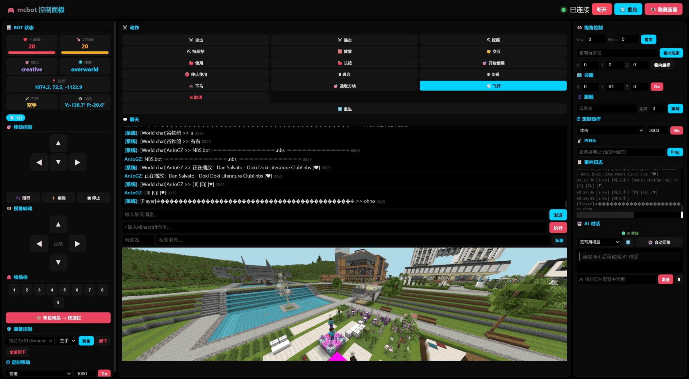

# mcbot-web

Minecraft Java Edition 网页控制台机器人，**纯 Node.js** 实现，基于 **Mineflayer + Express + SocketIO**。
启动后在浏览器中可视化控制 Bot。

## 架构

```
┌──────────────────────────────────────────────┐
│  Node.js 控制层 (server.js)                   │
│  - Express 静态文件服务                        │
│  - SocketIO 实时 WebSocket 通信               │
│  - Mineflayer 协议代理                        │
│  - Ollama AI 客户端                          │
│  - AI 自主控制模块                           │
│  - 聊天命令系统（**command）                   │
│  - 聊天日志记录                                │
│  - 状态轮询 & 事件转发                         │
│    │ TCP                                      │
└────┼──────────────────────────────────────────┘
     │
  Minecraft 服务器
```

## 功能特性

- **Mineflayer 协议代理**：Node.js Mineflayer 处理所有 MC 协议细节，兼容多版本
- **Web 控制台**：SocketIO 实时 Web 面板，可视化移动控制、视角转动、状态监控
- **控制台访问鉴权**：网页控制台默认需要密码访问（`web_auth_enabled` / `web_password`），防止未授权控制
- **画面渲染**：集成 prismarine-viewer，在浏览器中实时渲染机器人第一人称视角画面
- **聊天监听与命令响应**：监听公聊/私聊消息，响应 `command_prefix` 开头的玩家指令
- **AI 集成（Ollama / OpenAI 兼容 API）**：支持 AI 自动回复公聊/私聊（可配置回复模式）、AI 自主控制 Bot 行为（Function Calling），提供商可在 config 中切换
- **聊天日志记录**：玩家聊天/系统消息/命令等按日期每天一个文件写入（本地零点自动切换，无需重启），可通过 config 开关控制
- **权限控制**：信任玩家白名单，可限制高风险指令仅信任玩家使用
- **WASD 移动 & 寻路**：方向移动、跳跃、疾跑、坐标寻路、跟随玩家
- **视角转动**：D-pad 方向键/键盘箭头增量旋转视角，支持绝对角度设置和看向玩家
- **动作交互**：攻击实体、挖掘方块、放置方块（射线精确计算放置面）、与方块/实体交互（开门/开箱/骑乘等）、使用物品、潜行、疾跑、丢物品、切格子
- **背包管理**：背包物品移入快捷栏、装备/卸下物品（支持一键卸下全部）
- **实体交互**：骑乘、飞行模式（创造/旁观）
- **状态查询**：实时查询 Bot 位置/血量/饱食度/手持物品/潜行/疾跑/爬行/骑乘状态
- **自动恢复**：死亡自动重生、断连自动重连（指数退避）、连接超时检测（15s）、Web 面板一键重启

## 项目结构

```
mcbot-web/
├── server.js              # 单文件入口：Express + SocketIO + Mineflayer + Viewer + Ollama AI
├── templates/
│   └── index.html         # Web 控制台前端页面
├── config.json            # 配置文件
├── config.example.json    # 配置文件模板
├── package.json           # Node.js 依赖
├── scripts/
│   └── example.js         # 自定义脚本示例（**run example 运行）
├── logs/                  # 聊天日志目录（自动创建）
└── README.md
```

## 快速开始

### 前置要求

- Node.js 18+
- 目标 Minecraft 服务器需启用离线模式（offline mode）
- （可选）Ollama 本地运行，用于 AI 功能

### 安装

```bash
git clone https://github.com/RSSeeker/mcbot-nodejs.git
cd mcbot-nodejs
npm install
```

### 配置

复制 `config.example.json` 为 `config.json` 并编辑：

```json
{
    "server": {
        "host": "服务器地址",
        "port": 25565,
        "version": "1.21.4"
    },
    "bot": {
        "username": "Bot名称",
        "password": "登录密码（无密码留空）"
    },
    "command_prefix": "**",
    "web_auth_enabled": true,
    "web_password": "你的控制台密码",
    "reply_mode": "whisper",
    "track_players": ["玩家名1", "玩家名2"],
    "trusted_players": ["玩家名1"],
    "trusted_commands": ["restart", "stop", "cmd", "send", "run"],
    "viewer_port": 3000,
    "viewer_view_distance": 10,
    "log_chat_enabled": true,
    "log_dir": "./logs",
    "ai_enabled": true,
    "ai_provider": "ollama",
    "ollama": {
        "host": "http://localhost:11434",
        "model": "qwen3:8b",
        "system_prompt": "你是一个 Minecraft 游戏中的 AI 助手机器人。",
        "timeout": 60000,
        "max_history": 20
    },
    "external_api": {
        "url": "https://api.openai.com/v1/chat/completions",
        "api_key": "sk-你的API密钥",
        "model": "gpt-4o-mini",
        "system_prompt": "你是一个 Minecraft 游戏中的 AI 助手机器人。",
        "timeout": 60000,
        "max_history": 20
    },
    "keybindings": {
        "forward": "w",
        "left": "a",
        "back": "s",
        "right": "d",
        "jump": " ",
        "sneak": "shift",
        "sprint": "control",
        "drop": "q",
        "interact": "e",
        "attack": "f",
        "pick_block": "b",
        "fly": "v",
        "rotate_left": "arrowleft",
        "rotate_right": "arrowright",
        "rotate_up": "arrowup",
        "rotate_down": "arrowdown"
    }
}
```

| 字段 | 说明 |
|------|------|
| `server.host` | Minecraft 服务器地址 |
| `server.port` | 服务器端口 |
| `server.version` | 游戏版本 |
| `bot.username` | Bot 用户名 |
| `bot.password` | 登录密码（离线模式留空） |
| `command_prefix` | 游戏内指令前缀，可改为 `!`、`/` 等 |
| `web_auth_enabled` | 网页控制台是否要求密码，默认 true；设 false 关闭鉴权 |
| `web_password` | 网页控制台访问密码；留空且鉴权开启时启动随机生成并打印在控制台 |
| `reply_mode` | AI 回复模式：`whisper`（私聊）或 `public`（公屏 @提问者） |
| `track_players` | 追踪玩家列表，Bot 会跟随/响应这些玩家 |
| `trusted_players` | 信任玩家白名单，空数组 `[]` 表示信任所有玩家 |
| `trusted_commands` | 仅信任玩家可执行的指令列表（如 `restart`、`cmd` 等） |
| `viewer_port` | 画面渲染 HTTP 端口，默认 3000 |
| `viewer_view_distance` | 画面渲染区块视距，范围 2-20，默认 10 |
| `log_chat_enabled` | 是否启用聊天日志记录，默认 true |
| `log_dir` | 日志文件存放目录，默认 `./logs` |
| `ai_enabled` | 是否启用 AI 功能，设为 false 可完全关闭 |
| `ai_provider` | AI 提供商：`"ollama"` 或 `"external_api"`（默认 ollama） |
| `ollama.host` | Ollama 服务地址 |
| `ollama.model` | 使用的 AI 模型名称 |
| `ollama.system_prompt` | AI 系统提示词 |
| `ollama.timeout` | AI 请求超时（毫秒） |
| `ollama.max_history` | 每个会话保留的对话历史条数 |
| `external_api.url` | 外部 API 地址（OpenAI 兼容格式），为空则禁用 |
| `external_api.api_key` | 外部 API 密钥 |
| `external_api.model` | 外部 API 模型名称 |
| `external_api.system_prompt` | 外部 API 系统提示词 |
| `external_api.timeout` | 外部 API 请求超时（毫秒） |
| `external_api.max_history` | 外部 API 每个会话保留的对话历史条数 |
| `keybindings` | Web 键盘绑定配置，值设为 `""` 可禁用该按键 |

### 启动

```bash
npm start
```



启动后在浏览器打开 `http://localhost:5001`（首次会提示输入控制台密码，即 config.json 的 `web_password`；关闭鉴权则无需输入），可视控制面板功能包括：

- **连接配置**：网页顶部填写服务器/用户名/密码/画面端口/视距/追踪玩家等
- **画面渲染**：点击"画面"按钮在浏览器中实时渲染 Bot 第一人称视角
- **移动控制**：D-pad 方向键 + 跳跃/潜行/疾跑切换按钮，支持键盘快捷键（可在 config.json 中自定义按键绑定）
- **定时移动**：独立的方向+时长模块，Bot 按指定方向移动指定毫秒后自动停止
- **视角转动**：独立的视角 D-pad，键盘方向键控制，支持 Yaw/Pitch 精确输入和看向玩家/坐标
- **状态面板**：实时显示坐标、血量、饱食度、视角、手持物品、潜行/疾跑/爬行/骑乘/飞行状态
- **物品栏**：快捷栏 1-9 点击切换，一键移入背包物品
- **动作按钮**：攻击、连击、挖掘、持续挖、放置、交互、使用、长按使用、丢弃、全丢、选取方块、飞行、取消、重生
- **定时动作**：攻击/挖掘/长按使用 + 持续时间，到期自动停止
- **聊天面板**：实时公聊/私聊/系统消息，支持聊天输入和 Minecraft 指令执行
- **AI 对话**：与 AI 模型对话，支持模型切换下拉框、自动回复开关、历史清除
- **寻路/跟随**：输入坐标或玩家名进行导航，支持跟随距离设置
- **装备控制**：指定物品名装备到指定槽位，一键卸下全部
- **Ping 模块**：输入服务器地址（留空即当前服务器）查询服务器信息
- **重启**：Bot 连接后一键进程级重启

## 可用命令（游戏中）

### 基础命令

| 命令 | 说明 |
|------|------|
| `**help` | 列出所有可用命令 |
| `**send <消息>` | 让 Bot 发送公聊消息 |
| `**cmd <指令>` | 让 Bot 执行 Minecraft 指令 |
| `**ping [地址:端口]` | Ping 服务器（无参数=当前，有参数=外部服务器） |
| `**restart` | 进程级重启 Bot |
| `**run <脚本名> [参数]` | 运行 scripts/ 目录下的自定义 JS 脚本 |
| `**respawn` | 重生 |

### 移动与寻路

| 命令 | 说明 |
|------|------|
| `**move <方向> [毫秒]` | 移动：forward/back/left/right，默认1000ms |
| `**jump` | 跳跃 |
| `**stop` | 停止所有移动 |
| `**goto <x> <y> <z>` | 寻路到目标坐标 |
| `**follow <玩家> [距离] [keep]` | 跟随指定玩家，加 keep 持续跟随（**stop 停止） |
| `**fly [on/off]` | 切换飞行模式（创造/旁观模式） |

### 视角

| 命令 | 说明 |
|------|------|
| `**look <yaw> [pitch]` | 设置绝对视角角度 |
| `**look at <玩家名>` | 看向指定玩家 |
| `**rotate <水平°> [垂直°]` | 旋转视角（增量角度，如 `**rotate 90 -30`） |

### 动作

| 命令 | 说明 |
|------|------|
| `**attack [时间]` | 攻击视线中的实体，时间参数指定长按毫秒数 |
| `**dig [时间]` | 挖掘视线中的方块，时间参数指定长按毫秒数 |
| `**place` | 放置方块（对准方块表面） |
| `**interact` | 与方块/实体交互（开门/开箱/拉杆/村民交易/骑乘载具等） |
| `**use` | 使用手持物品（快速点击） |
| `**usehold [时间]` | 长按使用手持物品（吃东西等），默认2000ms |
| `**sneak` | 切换潜行状态（蹲下/起身） |
| `**sprint` | 切换疾跑状态 |
| `**drop` | 丢出手持物品 |
| `**dropall` | 丢出全部物品 |
| `**cancel` | 取消所有操作 |

### 背包与物品

| 命令 | 说明 |
|------|------|
| `**slot <1-9>` | 切换到快捷栏第 N 格 |
| `**equip <物品名> <槽位>` | 装备物品到指定槽位（hand/off-hand/head/torso/legs/feet） |
| `**unequip <槽位>` | 卸下指定槽位的物品 |
| `**unequipall` | 一键卸下全部装备（背包有空间时） |
| `**movetohotbar` | 将背包物品移入快捷栏的空位 |
| `**pickblock` | 选取准星方块（创造模式直接拿，生存模式切背包） |
| `**itemid` | 显示手中物品的名称和 ID |
| `**give <物品名> [数量]` | 从创造物品栏获取物品（仅创造模式，数量 1-64） |

### AI 命令

| 命令 | 说明 |
|------|------|
| `**ai <消息>` | 与 AI 对话 |
| `**aimode [on/off]` | 切换 AI 自动回复公聊 |
| `**aimodel [模型名]` | 切换/查看 AI 模型 |
| `**aimodels` | 列出可用 AI 模型 |
| `**aiclear` | 清除 AI 对话历史 |
| `**aicontrol [on/off/status]` | AI 自主控制 Bot 行为 |
| `**aidelay <毫秒>` | 设置 AI 自主控制间隔（1000-30000） |

> 指令前缀通过 `config.json` 中的 `command_prefix` 修改。

## 聊天日志

启用 `log_chat_enabled` 后，日志文件按日期保存在 `log_dir` 目录下，格式为 `chat_YYYY-MM-DD.log`；跨天（本地零点）自动切换新文件，无需重启。

日志记录的事件类型：

| 类型 | 内容 |
|------|------|
| `SYSTEM` | 系统消息 |
| `CHAT` | 玩家公聊 |
| `JOIN` / `LEAVE` | 玩家进出 |
| `LOGIN` / `SPAWN` | Bot 登录/出生 |
| `KICK` / `DEATH` / `DISCONNECT` | Bot 状态变化 |
| `ERROR` | Bot 错误 |
| `BOT_CHAT` / `BOT_CMD` | 网页端发送的聊天/指令 |
| `COMMAND` / `CMD_REPLY` | 玩家命令及回复 |
| `AI_REPLY` | AI 自动回复 |
| `WHISPER` | Bot 私聊 |
| `ACTION` | Bot 执行的动作 |

## 自定义脚本

通过 `**run <脚本名>` 命令运行 `scripts/` 目录下的 JS 脚本，实现自定义机器人操控。

### 脚本格式

```js
// scripts/your_script.js
module.exports = async function(bot, context) {
    const { reply, args, log, config } = context;

    // bot — Mineflayer Bot 实例，可调用所有 API
    // context.reply(msg) — 回复消息给命令发送者
    // context.args — 脚本参数数组
    // context.log(level, msg) — 写入服务端日志
    // context.config — 当前配置对象

    bot.chat('Hello!');
    reply('脚本执行成功！');
};
```

### 内置示例

```bash
**run example
**run example 参数1 参数2
```

### 安全提醒

- 网页控制台默认需要密码（`web_password`），公网部署时请务必修改默认密码并保持鉴权开启（`web_auth_enabled: true`）
- 建议将 `run` 加入 `trusted_commands`，仅信任玩家可执行
- 脚本拥有 `bot` 完整控制权，请勿运行不可信来源的脚本

## 连接超时

Bot 启动后 15 秒内未成功连接服务器，会自动断开并提示超时，避免进程卡死。

## 依赖

- [mineflayer](https://github.com/PrismarineJS/mineflayer) — Minecraft 协议客户端库
- [mineflayer-pathfinder](https://github.com/PrismarineJS/mineflayer-pathfinder) — 寻路与移动插件
- [prismarine-viewer](https://github.com/PrismarineJS/prismarine-viewer) — 基于 Three.js 的 Minecraft 世界渲染器
- [@napi-rs/canvas](https://github.com/Brooooooklyn/canvas) — Rust 实现的 Canvas 库，为 viewer 提供渲染后端
- [webpack](https://webpack.js.org/) — 模块打包工具，用于构建 viewer 前端资源
- [express](https://expressjs.com/) — HTTP 服务器
- [socket.io](https://socket.io/) — WebSocket 实时通信

## License

MIT
